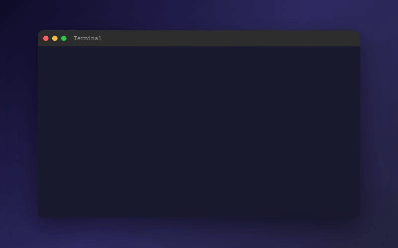
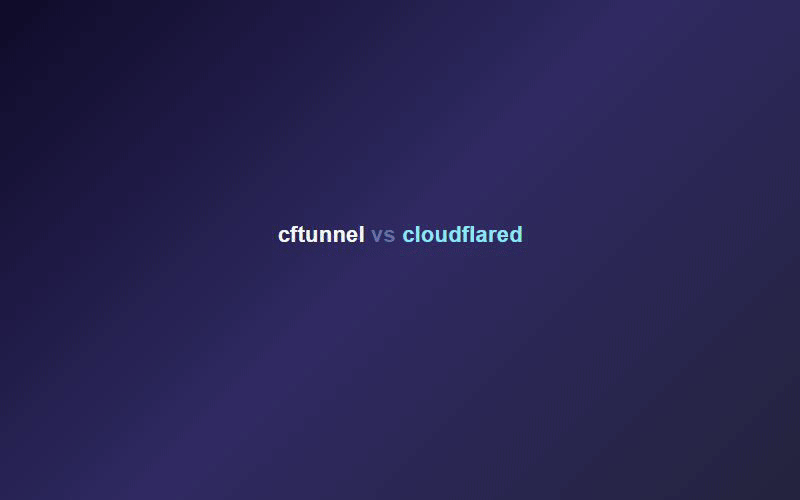

# cftunnel

[中文](README.md)

[](https://github.com/qingchencloud/cftunnel/releases)
[](https://goreportcard.com/report/github.com/qingchencloud/cftunnel)
[](LICENSE)

**An all-protocol tunneling tool** — free HTTP/WS tunneling with Cloud mode, plus self-hosted TCP/UDP tunneling with Relay mode.

[Compare modes](#compare) · [Install](#install) · [Quick start](#quickstart) · [Relay server](#relay-server) · [Commands](#commands) · [Troubleshooting](#troubleshooting) · [AI integration](#ai) · [Community](#contact)

Related projects: [cftunnel-app desktop client](https://github.com/qingchencloud/cftunnel-app) ([downloads](https://github.com/qingchencloud/cftunnel-app/releases)) · [ClawApp](https://github.com/qingchencloud/clawapp) · [OpenClaw Chinese Translation](https://github.com/1186258278/OpenClawChineseTranslation)

<p align="center">
  <video src="docs/videos/promo.mp4" width="720" controls></video>
</p>

> Need to share a local service? Expose a game server, SSH endpoint, or API without a public IP?
>
> cftunnel provides two tunnel engines in one CLI for every scenario.

**Cloud mode** (Cloudflare, free HTTP/WS tunneling):

```bash
cftunnel quick 3000
# ✔ Tunnel started: https://xxx-yyy-zzz.trycloudflare.com
```

**Relay mode** (self-hosted, full TCP/UDP tunneling):

```bash
cftunnel quick 25565 --relay
# ✔ Relay tunnel: tcp://localhost:25565 → remote port 25565
```

<p align="center">
  
</p>

<h2 id="compare">Mode comparison</h2>

<p align="center">
  
</p>

| Feature | Cloud mode | Relay mode |
|--------|-----------|-----------|
| Engine | cloudflared (Cloudflare Tunnel) | frpc/frps (frp) |
| Protocols | HTTP / HTTPS / WebSocket | TCP / UDP / HTTP / all protocols |
| Requires | Free Cloudflare account | Your own public server |
| Domain | Random `*.trycloudflare.com` or custom domain | Server IP + port |
| Encryption | Cloudflare encryption + global CDN | frp token authentication |
| Cost | Free | Server cost (from about $3/month) |
| Typical use cases | Web / API / Webhook / preview | Game server / database / SSH / remote desktop |
| Quick start | `cftunnel quick 3000` | `cftunnel quick 25565 --relay` |
| System service | `cftunnel install` | `cftunnel relay install` |

Both modes are independent and can run at the same time.

<p align="right"><a href="#cftunnel">⬆ Back to top</a></p>

<h2 id="features">Features</h2>

**Cloud mode (Cloudflare Tunnel):**
- **No-domain mode** — `cftunnel quick <port>` creates a temporary `*.trycloudflare.com` URL with zero setup.
- **Access protection** — add `--auth user:pass` to enable password protection through the built-in auth proxy.
- **Simple workflow** — `init` → `create` → `add` → `up` for a custom-domain tunnel.
- **Automatic DNS** — create CNAME records when adding routes and clean them up on removal.

**Relay mode (self-hosted):**
- **All protocols** — TCP / UDP / HTTP for game servers, databases, SSH, and remote desktop.
- **One-command deployment** — install with `curl | bash` or Docker Compose, then connect with `relay init`.
- **Quick tunnels** — `cftunnel quick <port> --relay` without pre-configuring rules.

**Shared:**
- **Cross-platform** — macOS (Intel/Apple Silicon), Linux (amd64/arm64), and Windows (amd64/arm64).
- **Process management** — downloads engine binaries and supports macOS launchd, Linux systemd, and Windows Service.
- **Self-update** — built-in version checks and one-command upgrades.
- **Portable mode** — place an empty `portable` file beside the binary to keep config, logs, and binaries local.
- **Desktop client** — [cftunnel-app](https://github.com/qingchencloud/cftunnel-app) provides a visual GUI.
- **AI-friendly** — bundled Claude Code / OpenClaw Skills let AI assistants manage tunnels directly.

<p align="right"><a href="#cftunnel">⬆ Back to top</a></p>

<h2 id="architecture">Architecture</h2>

cftunnel provides two independent tunnel engines:

**Cloud mode** — traffic travels through Cloudflare's global CDN and gets HTTPS without a public IP:

```
localhost:3000 → cftunnel → cloudflared → Cloudflare Edge → public users
                 (manager)    (tunnel)      (global CDN)     (domain access)
```

**Relay mode** — traffic travels through your public server and supports all protocols:

```
localhost:25565 → cftunnel → frpc → your public server (frps) → remote users
                  (manager)   (client) (relay server)             (IP:port access)
```

cftunnel is the management layer: it handles configuration, process orchestration, and binary downloads without proxying application traffic itself.

<p align="right"><a href="#cftunnel">⬆ Back to top</a></p>

<h2 id="install">Install</h2>

### One-line install (recommended)

**macOS / Linux:**

```bash
curl -fsSL https://raw.githubusercontent.com/qingchencloud/cftunnel/main/install.sh | bash
```

**Windows (PowerShell):**

```powershell
irm https://raw.githubusercontent.com/qingchencloud/cftunnel/main/install.ps1 | iex
```

### Manual download

Download the binary for your platform from [Releases](https://github.com/qingchencloud/cftunnel/releases).

### Build from source

```bash
git clone https://github.com/qingchencloud/cftunnel.git
cd cftunnel && make build
```

<p align="right"><a href="#cftunnel">⬆ Back to top</a></p>

<h2 id="quickstart">Quick start</h2>

### Option 1: Quick tunnel (zero configuration)

No account, token, or domain is required:

```bash
cftunnel quick 3000
# ✔ Tunnel started: https://xxx-yyy-zzz.trycloudflare.com
```

Add `--auth` when you need password protection:

```bash
cftunnel quick 3000 --auth admin:secret123
```

The random URL is temporary and expires when you press Ctrl+C.

### Option 2: Custom domain (Cloudflare)

> Requires a Cloudflare account and at least one domain.

1. Create an [API token](https://dash.cloudflare.com/profile/api-tokens) with Cloudflare Tunnel edit, DNS edit, and zone settings read permissions.
2. Copy your account ID from the Cloudflare dashboard.

```bash
cftunnel init --token <your-token> --account <account-id>
cftunnel create my-tunnel
cftunnel add myapp 3000 --domain app.example.com
cftunnel up
# app.example.com → localhost:3000
```

### Option 3: Relay mode (all protocols)

> Requires a public server (any VPS provider works).

Deploy the server as described in [Relay server deployment](#relay-server), then configure the client:

```bash
cftunnel relay init --server 1.2.3.4:7000 --token abc123
cftunnel relay add minecraft --local 25565 --remote 25565 --proto tcp
cftunnel relay add ssh --local 22 --remote 6022 --proto tcp
cftunnel relay up
cftunnel relay install
```

Quick Relay tunnels are also available:

```bash
cftunnel quick 25565 --relay
cftunnel quick 9987 --relay --proto udp
```

<p align="right"><a href="#cftunnel">⬆ Back to top</a></p>

<h2 id="relay-server">Relay server deployment</h2>

Relay mode uses frps on a public server. Choose one of the following deployment methods.

### Method A: SSH remote setup (recommended)

Install the server and configure the client from your workstation:

```bash
cftunnel relay server setup --host 1.2.3.4 --user root --key ~/.ssh/id_ed25519
# ✔ SSH connected
# ✔ frps installed and client configured
```

Password authentication (`--password`) and a fully interactive mode are supported.

### Method B: One-line script

Run this on the public server:

```bash
curl -fsSL https://raw.githubusercontent.com/qingchencloud/cftunnel/main/install-relay.sh | bash
```

The script downloads frps, generates a token, registers a systemd service, and prints the client command.

### Method C: Docker Compose

```bash
mkdir -p cftunnel-relay && cd cftunnel-relay
curl -fsSLO https://raw.githubusercontent.com/qingchencloud/cftunnel/main/docker/relay-server/docker-compose.yml
curl -fsSLO https://raw.githubusercontent.com/qingchencloud/cftunnel/main/docker/relay-server/frps.toml.example
cp frps.toml.example frps.toml
# Edit frps.toml and set auth.token
docker compose up -d
```

Open port 7000 and the ports used by your tunnels in the server firewall.

<p align="right"><a href="#cftunnel">⬆ Back to top</a></p>

<h2 id="commands">Command reference</h2>

### Cloud mode

| Command | Description |
|------|------|
| `cftunnel quick <port>` | Quick tunnel with a temporary domain |
| `cftunnel quick <port> --auth user:pass` | Quick tunnel with password protection |
| `cftunnel init` | Configure Cloudflare authentication |
| `cftunnel create <name>` | Create a named Tunnel |
| `cftunnel add <name> <port> --domain <domain>` | Add a route and create its CNAME |
| `cftunnel remove <name>` | Remove a route and clean up DNS |
| `cftunnel list` | List all routes |
| `cftunnel up / down` | Start or stop cloudflared |
| `cftunnel status` | Show tunnel status |
| `cftunnel logs [-f]` | View logs |
| `cftunnel install / uninstall` | Register or remove the system service |
| `cftunnel destroy [--force]` | Delete the tunnel, DNS records, and config |
| `cftunnel reset [--force]` | Reset all local configuration |

### Relay mode

| Command | Description |
|------|------|
| `cftunnel relay init --server <IP:port> --token <token>` | Configure the Relay server |
| `cftunnel relay add <name> --local <port> --proto tcp` | Add a TCP rule |
| `cftunnel relay add <name> --local <port> --proto udp` | Add a UDP rule |
| `cftunnel relay remove <name>` | Remove a rule |
| `cftunnel relay list` | List all rules |
| `cftunnel relay up / down` | Start or stop frpc |
| `cftunnel relay status` | Show connection status |
| `cftunnel relay check [rule]` | Check connectivity and latency |
| `cftunnel relay logs [-f]` | View logs |
| `cftunnel relay install / uninstall` | Register or remove the system service |
| `cftunnel relay server install` | Install frps on Linux |
| `cftunnel relay server setup` | Install frps over SSH |
| `cftunnel quick <port> --relay` | Quick Relay tunnel |
| `cftunnel quick <port> --relay --proto udp` | Quick UDP Relay tunnel |

### Version management

| Command | Description |
|------|------|
| `cftunnel version [--check]` | Show the version or check for updates |
| `cftunnel update` | Update to the latest version |

<p align="right"><a href="#cftunnel">⬆ Back to top</a></p>

<h2 id="config">Configuration</h2>

Configuration is stored at `~/.cftunnel/config.yml`:

```yaml
version: 1

auth:
  api_token: "your-token"
  account_id: "your-account-id"
tunnel:
  id: "tunnel-uuid"
  name: "my-tunnel"
  token: "tunnel-run-token"
routes:
  - name: myapp
    hostname: app.example.com
    service: http://localhost:3000

relay:
  server: "1.2.3.4:7000"
  token: "your-relay-token"
  rules:
    - name: minecraft
      proto: tcp
      local_port: 25565
      remote_port: 25565
    - name: game-voice
      proto: udp
      local_port: 9987
      remote_port: 9987

self_update:
  auto_check: true
```

`self_update.auto_check` is enabled by default. Set it to `false` to disable startup checks; the desktop update center checks both the CLI and desktop client.

<p align="right"><a href="#cftunnel">⬆ Back to top</a></p>

<h2 id="troubleshooting">Troubleshooting</h2>

### QUIC connection timeout

**Symptom:** `failed to dial to edge with quic: timeout`

**Fix:** cftunnel v0.6.1+ defaults to HTTP/2 (TCP). Re-register the service with `cftunnel uninstall && cftunnel install`.

### DNS hijacked by fake-IP

**Symptom:** cloudflared connects to `198.18.0.x`.

**Fix:** add the `cloudflared` process to your proxy TUN bypass list, or add `*.argotunnel.com` to the fake-IP filter.

### Cloudflare 1033

**Symptom:** the DNS CNAME points to an old Tunnel ID.

**Fix:** run `cftunnel remove <name>` and then `cftunnel add` to recreate the route.

### Cloudflare 530

**Symptom:** cloudflared is not connected to the Edge.

**Fix:** run `cftunnel logs -f` and use the error details to apply the fixes above.

### Relay connection failed

**Symptom:** `relay status` reports disconnected after `relay up`.

**Checklist:**
1. Run `cftunnel relay check` to test the server, local service, and remote port.
2. Confirm frps is running: `ssh SERVER "systemctl status frps"`.
3. Confirm port 7000 is open in the firewall.
4. Confirm the token matches with `cftunnel relay status`.
5. Review logs with `cftunnel relay logs -f`.

<p align="right"><a href="#cftunnel">⬆ Back to top</a></p>

<h2 id="ai">AI integration</h2>

cftunnel bundles AI assistant Skills so Claude Code, OpenClaw, and similar coding agents can manage tunnels directly.

### Claude Code

After cloning the repository, Claude Code loads the Skills automatically. For example:

```
Use cftunnel quick to share my local port 3000 temporarily.
Use cftunnel relay to expose my local port 25565.
```

<p align="right"><a href="#cftunnel">⬆ Back to top</a></p>

<h2 id="dev">Development</h2>

```bash
make build              # local build
git tag v0.x.0 && git push --tags  # tag pushes trigger a GitHub Actions release
```

<h2 id="contact">Community</h2>

- Website: [cftunnel.qt.cool](https://cftunnel.qt.cool)
- Telegram group: [Join the cftunnel community](https://t.me/+-53et5QXFh0xYzhk)
- QQ group: [OpenClaw community](https://qm.qq.com/q/qUfdR0jJVS)
- Issues: [GitHub Issues](https://github.com/qingchencloud/cftunnel/issues)

<h2 id="license">License</h2>

MIT

---

Maintained and open-sourced by [Qingchen Cloud](https://qingchencloud.com)
